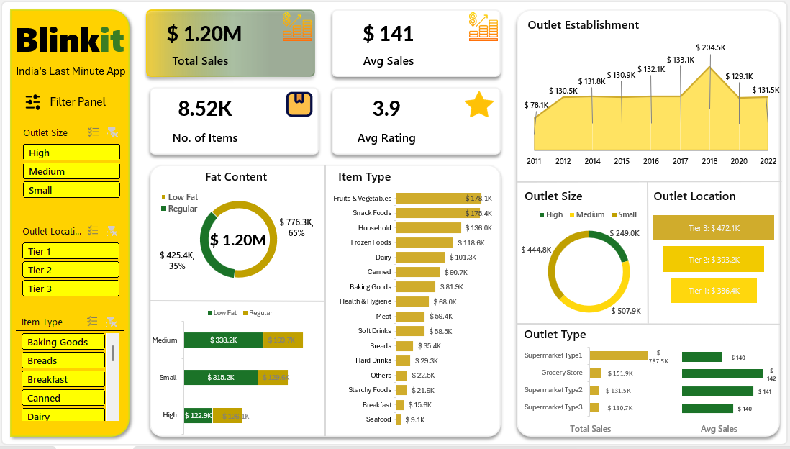

# Blinkit Grocery Analysis Dashboard

This project features a **Blinkit Grocery Analysis Dashboard** built using Excel. The dashboard provides actionable insights into grocery sales trends, outlet performance, and customer preferences, enabling data-driven decision-making for improved business outcomes.

## 📊 Project Overview

The dashboard is designed to address key performance indicators (KPIs) that analyze Blinkit's grocery sales. It provides a holistic view of sales performance segmented by product attributes, outlet characteristics, and regional distribution. 

## 🚀 Features and KPIs

This Dasbhoard highlights the following key metrics:

1. **Total Sales**: Blinkit achieved an impressive **$1.20M** in total sales, reflecting its growing customer base.
2. **Total Items Sold**: Over **8.52K** items sold, showcasing high demand.
3. **Average Sales per Transaction**: Recorded at **$141**, illustrating efficient pricing strategies.
4. **Customer Satisfaction**: An average rating of **3.9**, offering a glimpse into customer feedback.
5. **Sales by Fat Content**: Analyzes the impact of low-fat vs. regular-fat products on total sales.
6. **Sales by Outlet Size and Location**: Identifies high-performing outlet categories and regional patterns.

---

### Interactive Insights
The dashboard provides deeper insights into:
- **Sales by Product Categories**: Visualizes the contribution of different item types like fruits, snacks, and household items.
- **Outlet Performance**: Evaluates the influence of outlet size, type, and establishment age on total sales.
- **Regional Trends**: Compares sales performance across Tier 1, Tier 2, and Tier 3 locations.

The use of dynamic charts and slicers makes exploring the data intuitive and engaging.

## 🛠️ Tools and Techniques

- **Microsoft Excel**: Designed the interactive dashboard with pivot tables, slicers, and dynamic visualizations.
- **Data Analysis**: Processed and cleaned raw data to calculate KPIs and uncover actionable insights.

## 💡 Insights Gained

1. **Fat Content Preference**: Regular-fat products dominate sales, contributing to **65%** of total revenue.
2. **Top-Selling Categories**: Fruits and vegetables lead in sales, followed by snacks and household items.
3. **Outlet Performance**: Large outlets outperform smaller ones due to better inventory and capacity.
4. **Establishment Age**: Older outlets contribute significantly to consistent sales, indicating customer trust and loyalty.

## Files Included
- `Blinkit Analysis Dashboard.xlsx`: The interactive dashboard designed for analysis.
- `Blinkit Data.xlsx`: The cleaned and structured dataset used to build the dashboard.

## 📧 Contact

- **Email**: [bahawanas427@gmail.com](mailto:bahaamedhat2022@gmail.com)  
- **LinkedIn**: [Bahaa Wanas](https://www.linkedin.com/in/bahaa-wanas-9797b923a/)  
